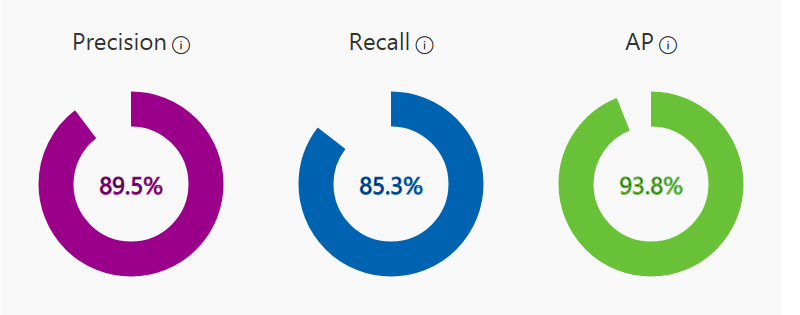
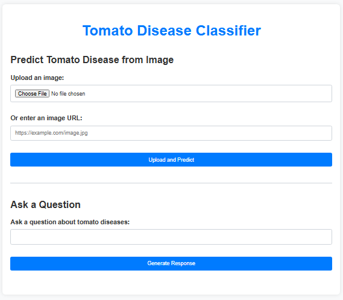
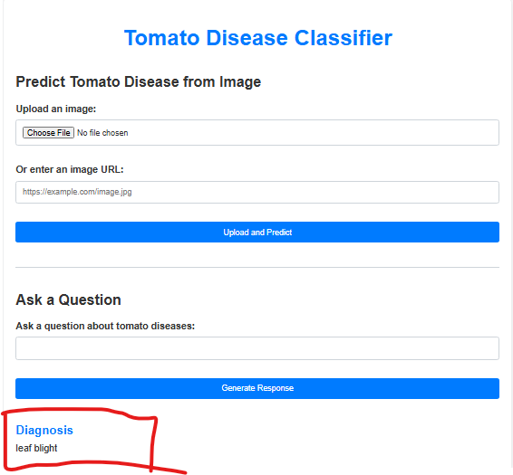
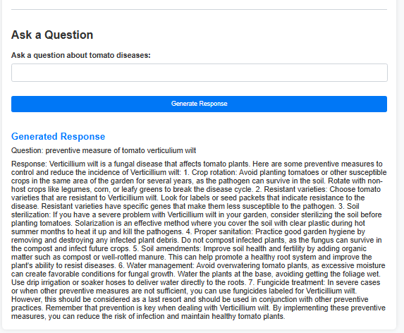

## Solution Implementation

### Overview

This document describes the prototype implementation of the Tomato Disease Classifier App, detailing the development process, decisions made, challenges faced, and solutions implemented.

### Development Environment

The prototype is being developed using GitHub Codespaces, a cloud-based development environment that provides a fully configured Visual Studio Code environment within the browser. This enables seamless collaboration among team members and eliminates the need for individual setup.

### Technology Stack

The following technologies are being used for developing the prototype:

- **Flask**: Python web framework for building the backend of the application.
- **HTML/CSS**: For designing the user interface of the web application.
- **Azure Custom Vision**: Used for training and deploying the machine learning model for disease classification.
- **Azure Web App**: Chosen as the deployment platform for hosting the web application.
- **Azure OpenAI Service**: Used for generating responses to questions about tomato diseases.

### Development Process

1. **Setting Up Environment**: The development environment was set up using GitHub Codespaces, and necessary dependencies were installed.

2. **Model Training**: The custom vision model was trained using Azure Custom Vision service. The dataset was uploaded, and the model was trained to classify tomato diseases.

3. **Web App Development**: Flask framework was used to develop the backend of the web application. HTML and CSS were used for designing the frontend interface.

4. **Integration**: The trained custom vision model was integrated into the Flask backend to enable disease classification based on uploaded images. Additionally, the Azure OpenAI Service was integrated to handle user queries about tomato diseases.

5. **Testing**: The prototype was thoroughly tested to ensure functionality and accuracy. Unit tests were performed to validate different components of the application.

### Model Performance

The performance of the trained computer vision model is summarized below:

- **Precision**: 89.5%
- **Recall**: 85.3%
- **Average Precision (AP)**: 93.8%

These metrics indicate a high level of accuracy and reliability in detecting and classifying tomato diseases from the provided images.

### Integration with GitHub and Azure

- The project is linked to a GitHub repository for version control and collaboration.
- Continuous Integration/Continuous Deployment (CI/CD) pipelines were set up to automatically deploy the application to Azure Web App, ensuring seamless updates and maintenance.

### Challenges Faced

1. **Communication**: Lack of effective communication among team members led to delays during the development process.
2. **Deployment Issues**: Faced challenges while deploying the application to Azure Web App due to runtime dependencies and configuration issues. The team had limited experience with Azure deployment, resulting in uncertainty regarding the setup process and troubleshooting steps.

### Solutions Implemented

1. **Research and Documentation**: Extensive research and documentation were done to understand the deployment process and resolve issues effectively.
2. **Improved Communication**: Regular team meetings and communication channels were established to ensure effective collaboration and problem-solving.

### Next Steps

1. **Refinement**: Continuously refine the application based on user feedback and testing results to improve accuracy and user experience.
2. **Scalability**: Explore options for scaling the application to handle larger volumes of data and users.
3. **Maintenance**: Implement regular maintenance procedures to keep the application up-to-date and secure.
4. **Feature Enhancements**: Add additional features to enhance the functionality of the application, such as support for more disease categories and predictive analytics.

### Conclusion

The prototype implementation of the Tomato Disease Classifier App represents a significant step towards addressing the challenges faced by farmers in disease detection and management. By leveraging machine learning and web technologies, the application aims to provide an efficient and user-friendly solution for early disease detection in tomato crops. Continued refinement and development will ensure the application meets the needs of its users and contributes to improving agricultural practices.

### Web App Interface

Below are images of the web app interface and its functionalities:

#### Web App Interface

#### Web App Predicting the Disease from the Image

#### Web App Generating Response from Queries

### Repository and Deployment

The codebase for the Tomato Disease Classifier App is available on GitHub and is automatically deployed using Azure Web App. This setup ensures that the latest code changes are always reflected in the deployed application, enabling continuous delivery and integration.

You can access the GitHub repository [here](https://github.com/armaf002/tomato__1).

The deployed application can be accessed [here](https://tomatodiseaseclassifier.azurewebsites.net/).

